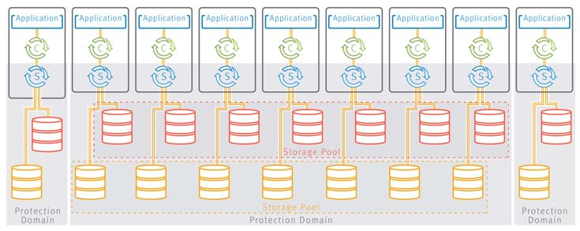
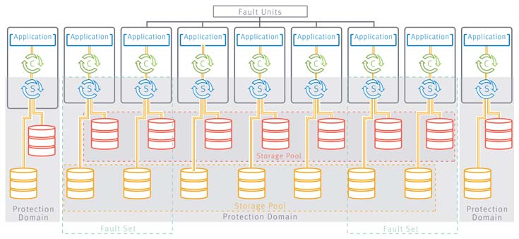
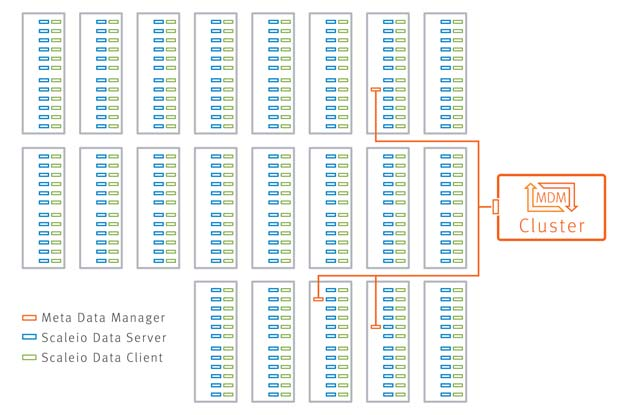

# System
## Hardware
- **Node** hoặc **Server** được sử dụng để cài đặt và chạy hệ thống ScaleIO  
- **Storage Media** có thể là bất kỳ loại phương tiện lưu trữ nào như HDD, SSD...  

## Software
- Meta Data Manager - MDM: Cấu hình và giám sát hệ thống ScaleIO. MDM chứa tất cả các metadata cần thiết cho hoạt động của hệ thống.  
- ScaleIO Data Server - SDS: Quản lý dung lượng của 1 server và hoạt động như 1 back-end để truy cập dữ liệu. SDS được cài đặt trên tất cả các máy chủ đóng góp thiết bị lưu trữ vào hệ thống ScaleIO. Các thiết bị này được lưu trữ thông qua SDS.  
- ScaleIO Data Client - SDC: Driver cho phép hiển thị volume ScaleIO làm block device cho ứng dụng nằm trên cùng 1 server mà SDC được cài đặt.  
- Installation Manager: IM là trình quản lý để cài đặt ScaleIO và các tính năng của ScaleIO, IM là 1 phần của Gateway.  
- Gateway: Bao gồm IM, Rest Gateway & SNMP trap.  
- Light Installation Agent: được cài đặt trên tất cả các node ScaleIO & tạo ra sự tin tưởng với IM để tạo điều kiện hoạt động cho nó.  

  

# MDM cluster
MDM được sử dụng để giám sát và cấu hình hệ thống ScaleIO. MDM được sử dụng để migrate, rebuild & tất cả các chức năng khác liên quan đến hệ thống. Không có I/O qua MDM. Để hỗ trợ HA, MDM có thể được cấu hình cluster, trong đó có 1 Master, còn lại sẽ là Slave hoặc Tie Breaker.  
Các loại về MDM:  
- MDM: MDM có 1 ID duy nhất.  
- Standby MDM & Tie Beaker: MDM & Tie Breaker có thể được thêm vào hệ thống ở chế độ standby. MDM Standby có thể được gọi để trở thành Manager MDM hoặc Tie Breaker.  
- Manager MDM: Là MDM master hoặc Slave.  
- Tie-Breaker: Dùng để xác định xem MDM nào là Master.  

Các thuật ngữ về MDM:  
- Master MDM: Kiểm soát SDS & SDC. Master MDM chứa và cập nhật MDM repository, là cơ sở dữ liệu lưu trữ cấu hình SDS, và cách dữ liệu được phân phối giữa các SDS. Repo này được replicate đến các Slave MDM.  
- Slave MDM: là MDM sẽ thay thế Master khi cần thiết.  
- Replica: MDM có chứa bản sao của MDM repo.  

# Storage definition
## Protection Domain
Là 1 thực thể vật lý chứa tập hợp các SDS để backup cho nhau. Mỗi SDS thuộc 1 và chỉ 1 Protection Domain.  

## Storage Pool
Cho phép tạo ra các lớp lưu trữ khác nhau trong hệ thống ScaleIO. 1 Storage Pool là 1 tập hợp các thiết bị lưu trữ vật lý trong 1 Protection Domain. Mỗi thiết bị lưu trữ thuộc 1 và chỉ 1 Storage Pool.  
  

Mỗi Storage Pool có thể hoạt động trong các mode sau:  
- Zero padding enabled: Đảm bảo răng mọi lần đọc từ 1 vùng chưa từng được ghi trước đó sẽ trả về Zero. Nó cũng đảm bảo việc đọc từ 1 volume sẽ không trả về thông tin đã được xóa trước đó. Mode này phải chịu việc giảm hiệu suất trong lần ghi đầu tiên.  
- Zero padding disable: Đảm bảo rằng việc đọc từ 1 vùng chwua từng được ghi trước đó sẽ trả về nội dung không rõ. 

Zero padding cần phải enable trong các TH sau:  
- Replicate volume  trong Storage Pool bằng RecoverPoint  
- Các ứng dụng khi đọc từ các vùng không được ghi vào trước, storage sẽ trả lại zero hoặc dữ liệu nhất quán.

**Note:** Zero padding không thể thay đổi sau khi thêm thiết bị đầu tiên vào 1 Storage Pool cụ thể.  

## Fault Set
Là 1 thực thể vật lý chứa tập hợp các SDS trong 1 Protection Domain, có khả năng cao sẽ down cùng nhau ví dụ như được các thiết bị được cung cấp điện bởi cùng 1 rack. Bằng cách nhóm chúng vào 1 Fault Set, việc replicate dữ liệu cho các thiết bị trong cùng 1 Fault Set nên nằm trên các SDS nằm ngoài Fault Set.  
Khi định nghĩa Fault Set, fault unit có thể là 1 Fault Set hoặc 1 SDS không liên quan Fault Set.  
  
Để sử dụng Fault Set:  
- Đảm bảo có 1 Protection Domain  
- Đảm bảo có 1 Storage Pool và Fault Set (tối thiểu 3 fault unit)  
- Thêm SDS, chỉ định Protection Domain & Fault Set, đồng thời thêm các thiết bị SDS vào 1 Storage Pool.  

# Protection & Load Balancing
ScaleIO duy trì dữ liệu người dùng trong RAID-1 mesh. Mỗi phần dư liệu được lưu trữ trên 2 server khác nhau, các bản sao được phân phối ngẫu nhiên đến các thiết bị lưu trữ. Quá trình rebuild & rebalance diễn ra hoàn toàn tự động nhưng vẫn có thể cấu hình được.  

## Rebuild
Khi có 1 lỗi xảy ra, ScaleIO ngay lập tức khởi tạo 1 quá trình bảo vệ dữ liệu. Quá trình này được gọi là rebuild. Có 2 kiểu rebuild trong ScaleIO và trong tùy trường hợp ScaleIO sẽ tự động chọn kiểu rebuild lại:  
- Forward rebuild: là quá trình tạo 1 bản sao của dữ liệu trên server mới. Trong quá trình này tất cả các thiết bị trong Storage Pool làm việc với nhau theo mode many-to-many, để tạo ra các bản sao mới của tất cả các block storage lỗi.  
- Backward rebuild: là quá trình xảy ra khi máy chủ chỉ down trong khoảng thời gian ngắn, các dữ liệu sẽ được tái đồng bộ bằng cách chỉ chuyển đến bản sao những thay đổi được thực hiện với dữ liệu.  

## Rebuild Throttling 
Rebuild Throttling đặt lại độ ưu tiên cho việc rebuild trong Storage Pool. Các chính sách có thể được set priority:  
- No Limit: Không giới hạn rebuild I/O. Khi rebuild I/O sẽ được gửi tới các thiết bị ngay lập tức mà không cần phải xếp hàng. Việc đặt ưu tiên này sẽ đẩy nhanh quá trình rebuild nhưng sẽ có tác động tối đa lên ứng dụng I/O.  
- Limit Concurrent I/O: Giới hạn số lượng I/O đồng thời cho mỗi SDS device (default).  
- Flavor Application I/O: Giới hạn rebuild cả bandwidth & số lượng I/O đồng thời.  
- Dynamic Bandwidth Throttling: Giới hạn rebuild cả bandwidth & số lượng I/O đồng thời theo ngưỡng thiết bị I/O.  
- Default rebuild I/O đồng thời giới hạn là 1 concurrent I/O.  

## Rebalance 
Là quá trình di chuyển các bản sao đến 1 máy chủ khác. Nó xảy ra khi ScaleIO phát hiên ra rằng dữ liệu người dùng không cân bằng giữa các thiết bị trong 1 Storage Pool.  

## Rebalance Throttling
Rebalance Throttling đặt lại độ ưu tiên cho việc rebuild trong Storage Pool. Policy Default là Flavor Application I/O, Limit 1 concurrent I/O & Bandwidth Limit 10240 KB/s.  

# Caching
Để nâng cao hiệu suất của hệ thống, ScaleIO cung cấp 1 vài tùy chọn cache:  
- RAM Read Cache (Using DRAM server memory)  
- Read Flash Cache (Using SSD & NVMe SSD devices)  

# Networking
Trong ScaleIO, viêc giao tiếp giữa các node có thể thực hiện trên 1 mạng riêng biệt hoặc trên 1 mạng thường.  

# Implement ScaleIO
Build Physical Storage Layer & Config virtual SAN layer
## Physical layer
Lớp vật lý bao gồm phần cứng (server, storage device, network) & phần mềm ScaleIO được cài đặt:  
- Cài đặt các thành phần MDM.  
- Cài đặt SDS trên các node sẽ đóng góp 1 phần hoặc toàn bộ storage. Mỗi SDS nằm trong 1 Protection Domain.  
- Cài đặt SDC trên tất cả các node mà ứng dụng sẽ dữ liệu bởi volume ScaleIO.  

  

## SAN virtualization layer
MDM cluster quản lý toàn bộ hệ thống ScaleIO. Nó tập hợp toàn bộ các storage để tạo ra 1 storage SAN ảo. Volume có thể được tạo ra qua Storage Pool và có thể sử dụng bởi các ứng dụng như 1 thiết bị lưu trữ cục bộ sử dụng SDC.  

## Other function
- Call Home: Cho phép gửi noti của các event.  
- Get Info: Cho phép lấy log.  
- Quality of Service: Có thể điều chỉnh bandwidth và storage mà SDC được sử dụng.  
- Obfuscation: Data có thể bị xáo trộn để bảo vệ.  
- Background Device Scanner: liên tục quét để tìm kiếm, sửa chữa các thiết bị lỗi. Có 2 cơ chế quét:  
	- Device only mode: Nếu 1 khu vực lỗi được đọc, mỗi lỗi sẽ được tạo ra và sẽ cố gắng sửa chữa thiết bị lỗi bằng thiết bị tốt. Nếu sửa thành công, bộ đếm sửa lỗi sẽ tăng lên. Nếu không thành công, lỗi sẽ được thông báo. Nếu việc đọc không thành công trên cả 2 thiết bị, scanner sẽ chuyển sang thiết bị tiếp theo.  
	- Data comparison mode (Chỉ hoạt động nếu zero padding được bật): Giống với device only mode nhưng khi đọc thành công từ cả 2 thiết bị, scanner tính toán và so sánh checksum, nếu so sánh thành công bộ đếm lỗi được tăng lên, nếu không scanner sẽ ghi đè thiết bị secondary bằng dữ liệu của thiết bị primary. Nếu không ghi đè được lỗi sẽ được thông báo.  

# Snapshot
ScaleIO cho phép tạo 31 snapshot cho mỗi volume.  
**Consistency Group** là 1 nhóm các snapshot được snapshot cùng nhau.  
**VTree** là 1 cây từ volume gốc và các snapshot con.  

