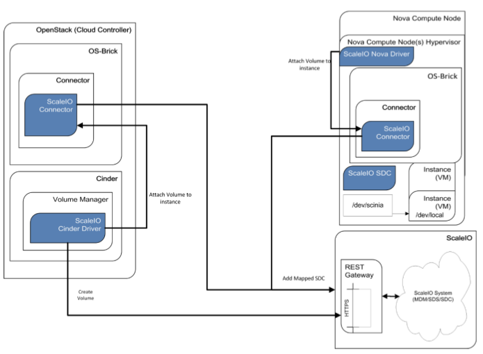

# ScaleIO Openstack
Giao tiếp giữa Cinder và ScaleIO MDM thực hiện bằng cách sử dụng REST API. Thường được sử dụng trong TH tạo/xóa volume.  
Openstack OS-Brick tìm ra các volume đã được attach tới host, đồng thời điều khiển việc attach/detach volume. Khi Nova/Cinder muốn attach/detach volume nó sẽ sử dụng OS-Brick để thực hiện hành động với ScaleIO Driver, OS-Brick sẽ gọi đến các command add/remove mapped SDC. Flows:  
- Create volume: Cinder call the ScaleIO add_volume  
- Map volume: Cinder call OS-Brick, OS-Brick tìm kiếm volume và call ScaleIO thực hiện command map volume sdc  
- Sau đó volume sẽ được nhận biết là đã attach trên cả Openstack và ScaleIO  

